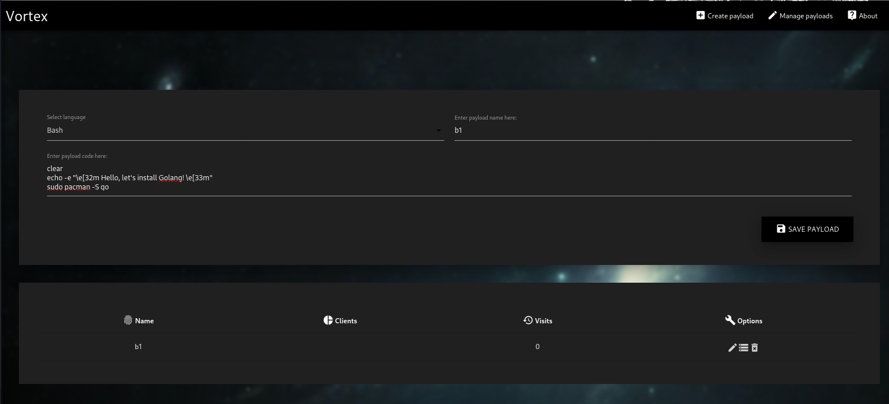
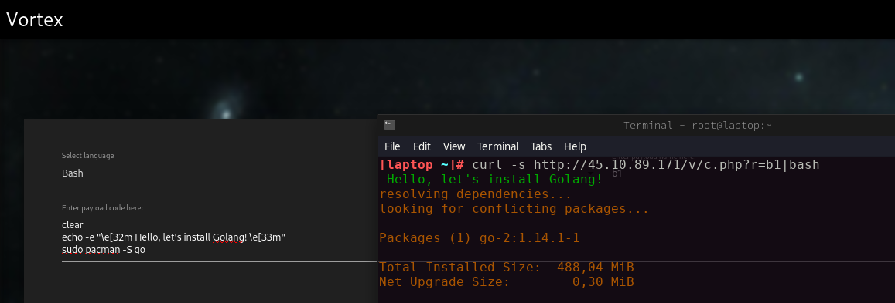

# :cyclone: Vortex
> You can reduce the code of your program in 1 line. And run in a Linux terminal.

___

## :telescope: Languages:
* python
* golang
* ruby
* bash
* perl
* lua
* C++
* C

## :jack_o_lantern: Create payload:

  

## :gift: Run payload:

  

## :satellite: Installation server files:
* Upload files from `server` directory to you server
* Change default username, password in protection.php
* Go to http://you.host/vortex.php
* Create payload
